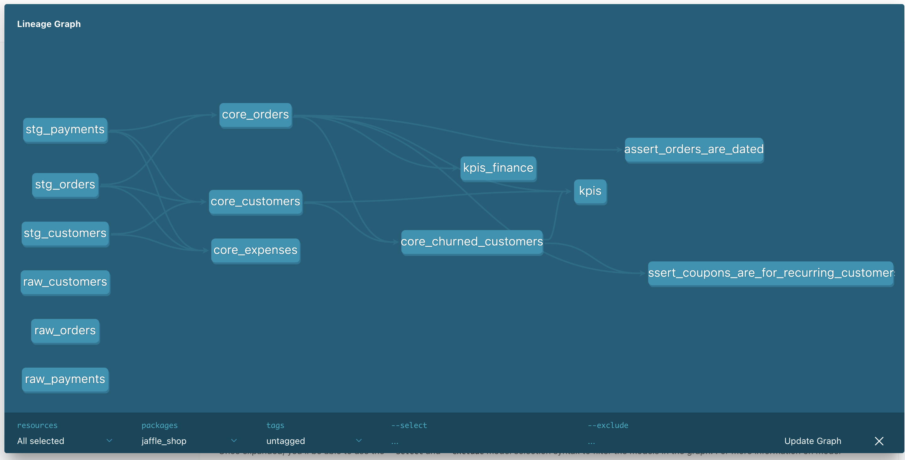

# Jaffle shop example

This example is taken from the [`jaffle_shop` example](https://github.com/dbt-labs/jaffle_shop/) from dbt. Here is the scripts file structure:

```
models
├── analytics
│   ├── finance
│   │   └── kpis.sql
│   └── kpis.sql
├── core
│   ├── customers.sql
│   └── orders.sql.jinja
├── staging
│   ├── customers.sql
│   ├── orders.sql
│   └── payments.sql
└── tests
    └── orders_are_dated.sql
```

The first thing to do install environment using `uv` preferably

```sh
uv sync
```

This example uses DuckDB as the data warehouse.

You can run the models to populate tables:

```sh
uv run dbt run
```

There are a couple of cool things:

1. The orchestration is completely managed by `dbt`. E.g if `model_a` depends on `model_b`, it will be ran in correct order.
2. The staging schema is populated using SQL scripts and native DuckDB parsing of CSV files.
3. The `core.orders` table is created using a Jinja SQL script. `dbt` will automatically run the model through Jinja, and then execute the resulting SQL.
4. When doing a `dbt build`, the models will be built in fail fast. E.g tests are ran on each model, and if it fails, it will skip downstream models.

## Document

It's possible to generate the static site of documentation using :

```sh
uv run dbt docs generate
uv run dbt docs serve
```

and review the docs



- Tables are materialized since you ran earlier `dbt run`

## Write

- Add a new script `core/core_churned_customers.sql`

The idea is to detect recurring customers which have not ordered since 30 days.

```sh
echo '''
WITH customer_orders AS (
    SELECT
        customer_id,
        COUNT(order_id) AS total_orders,
        MAX(order_date) AS last_order_date
    FROM {{ ref('core_orders') }}
    GROUP BY customer_id
),
max_order_date AS (
    SELECT MAX(order_date) AS max_date,
    30 AS max_days
    FROM {{ ref('core_orders') }}
),
churned_customers AS (
    SELECT
        customer_id,
        co.median_order_value,

        DATE_DIFF('day', co.last_order_date, max_date) AS days_since_last_order
    FROM {{ ref('core_customers') }} AS cc, max_order_date
    LEFT JOIN customer_orders AS co ON cc.customer_id = co.customer_id
    WHERE total_orders > 1
      AND DATE_DIFF('day', last_order_date, max_date) > max_days
)
SELECT
    customer_id,
    median_order_value,
    ROUND(median_order_value * 0.20, 2) AS coupon_amount
FROM churned_customers
''' > models/core/core_churned_customers.sql
```

```sh
echo '''
WITH customers_with_coupouns AS (
  SELECT
    customer_id
  FROM
    {{ ref('core_churned_customers') }}
),
customer_orders_counts AS (
  SELECT
    customer_id,
    COUNT(order_id) AS total_orders,
  FROM {{ ref('core_orders') }}
  GROUP BY customer_id
)
SELECT
  c.customer_id
FROM customers_with_coupouns AS c
LEFT JOIN customer_orders_counts AS co
  ON c.customer_id = co.customer_id
WHERE total_orders <= 1
''' > tests/assert_coupon_generated_recurring_customers_only.sql
```

A new test is written to ensure only recurring customers are given coupons.

## Audit

- Run the new models `dbt build && dbt test` : test `assert_coupon_generated_recurring_customers_only` is failing ❌
- Uncomment and comment lines to exclude new customers with only 1 order adding a filter in WHERE clause.

```sh
sed -i '' '/--uncomment here/s/-- //' tests/assert_coupon_generated_recurring_customers_only.sql
```

- Run again models with `dbt build`
- All tests are now passing 🎉

## Publish

- As all tests passed, tables are materialized in the development warehouse.
- If you want now to run it against production and not development warehouse, you would target `prod` profile

```sh
uv run dbt build --target prod
```
